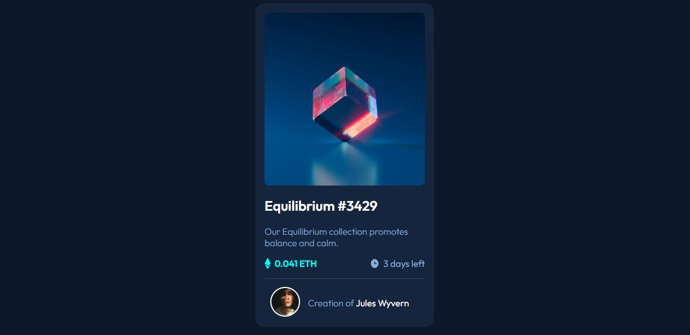

# Frontend Mentor - NFT preview card component solution

This is a solution to the [NFT preview card component challenge on Frontend Mentor](https://www.frontendmentor.io/challenges/nft-preview-card-component-SbdUL_w0U). Frontend Mentor challenges help you improve your coding skills by building realistic projects. 

## Table of contents

- [Overview](#overview)
  - [The challenge](#the-challenge)
  - [Screenshot](#screenshot)
  - [Links](#links)
- [My process](#my-process)
  - [Built with](#built-with)
  - [What I learned](#what-i-learned)
  - [Continued development](#continued-development)
  - [Useful resources](#useful-resources)
- [Author](#author)
- [Acknowledgments](#acknowledgments)

**Note: Delete this note and update the table of contents based on what sections you keep.**

## Overview

### The challenge

Users should be able to:

- View the optimal layout depending on their device's screen size
- See hover states for interactive elements

### Screenshot



### Links

- Solution: [Solution on frontend mentor](https://www.frontendmentor.io/solutions/nft-card-using-css-and-html-6wuFhgT9uS)
- Live Site URL: [Live site](https://nft-card-vector.vercel.app/)

## My process

### Built with

- Semantic HTML5 markup
- CSS custom properties
- Flexbox
- Mobile-first workflow

**Note: These are just examples. Delete this note and replace the list above with your own choices**

### What I learned

Something I learned during this project


```css
.image-container{
    width: 100%;
    height: 50vh; 
    max-height: 302px;
    background-image: url('images/image-equilibrium.jpg');
    background-position: center;
    background-position: fixed;
    background-size: cover; /* This line especially */
}
```


If you want more help with writing markdown, we'd recommend checking out [The Markdown Guide](https://www.markdownguide.org/) to learn more.


### Continued development

While building this project, I had the most difficulty with setting the hover state for the NFT image. I ended up having to use the ::before attribute in my CSS and a little help from another programmer. I wish to refine my accessibility skills to help me with further similar challenges and projects.


### Useful resources

- [Anerpeco's code](https://github.com/anerpeco/nft-preview-card-component) - This helped me with the hover state for my nft image (the eye icon that displays over the image when the cursor hovers over it). I really liked this pattern and will use it going forward, I will also explore more options.
- [w3schools doc](https://www.w3schools.com/howto/howto_css_image_overlay.asp) - This is an amazing article which helped me with understanding the concept of overlaying colors on images.


## Author

- Website - [Vector](https://github.com/VectorGits)
- Frontend Mentor - [@VectorGits](https://www.frontendmentor.io/profile/VectorGits)
- Twitter - [@Vector_keen](https://twitter.com/Vector_keen)


## Acknowledgments

Special thanks to [Ayo](https://github.com/Ayblue004)


